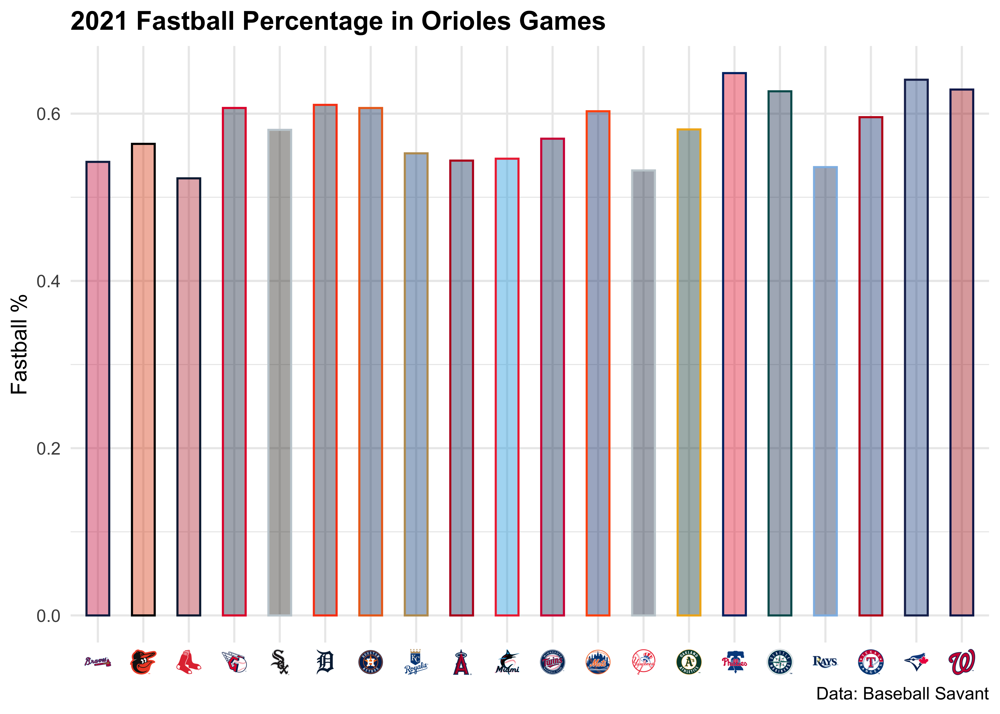
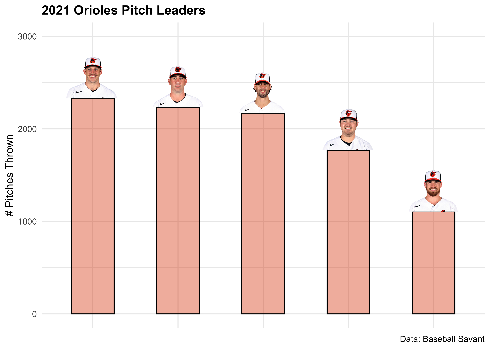

<!-- README.md is generated from README.Rmd. Please edit that file -->

# mlbplotR <a></a>

<!-- badges: start -->

[](https://lifecycle.r-lib.org/articles/stages.html)
<!-- badges: end -->

The code for this package was copied heavily from
[nflplotR](https://nflverse.github.io/nflplotR/index.html) with minor
changes to support Major League Baseball logos.

The goal of mlbplotR is to provide functions and geoms that help with
visualizations of MLB related analysis. It provides ggplot2 geoms that
do the heavy lifting of plotting MLB logos in high quality, with correct
aspect ratio, and possible transparency.

## Installation

mlbplotR is currently not on [CRAN](https://CRAN.R-project.org) but you
can get the development version from [GitHub](https://github.com/) with:

``` r
# install.packages("devtools")
devtools::install_github("camdenk/mlbplotR")
```

## Examples

Let’s plot every team on a grid with some extra customization:

``` r
library(mlbplotR)
library(ggplot2)
library(dplyr)

teams_colors_logos <- mlbplotR::load_mlb_teams() %>% 
  dplyr::filter(!team_savant_abbr %in% c("AL", "NL", "MLB")) %>% 
  dplyr::mutate(
    a = rep(1:6, 5),
    b = sort(rep(1:5, 6), decreasing = TRUE),
    alpha = ifelse(grepl("A", team_savant_abbr), 1, 0.75), # Keep alpha == 1 for teams that have an "A"
    color = ifelse(grepl("E", team_savant_abbr), "b/w", NA) # Set teams that have an "E" to black & white
  )


 ggplot2::ggplot(teams_colors_logos, aes(x = a, y = b)) +
   mlbplotR::geom_mlb_logos(aes(team_savant_abbr = team_savant_abbr, color = color, alpha = alpha), width = 0.075) +
   ggplot2::geom_label(aes(label = team_savant_abbr), nudge_y = -0.35, alpha = 0.5) +
   ggplot2::scale_color_identity() +
   ggplot2::scale_alpha_identity() +
   ggplot2::theme_void() 
```


This is a basic example with [Baseball
Reference](https://baseball-reference.com) data which compares ERA to
FIP:

``` r
library(readr)
library(scales)

df <- readr::read_csv("./data-raw/2021-Team-Pitching-Stats.csv")
  
# Join leaderboard with abbrevations
joined_df <- df %>% 
  left_join(teams_colors_logos, by = c("Tm" = "team_name"))


joined_df %>%
  ggplot2::ggplot(aes(x = ERA, y = FIP)) +
  mlbplotR::geom_mlb_logos(aes(team_savant_abbr = team_savant_abbr), width = 0.075, alpha = 0.7) +
  ggplot2::labs(
    caption = "Data: Baseball Reference",
    title = "2021: ERA vs. FIP"
  ) +
  ggplot2::theme_minimal() +
  ggplot2::theme(
    plot.title = ggplot2::element_text(face = "bold")
  ) +
  ggplot2::scale_x_reverse(breaks = scales::pretty_breaks(), expand = c(.1, .1)) +
  ggplot2::scale_y_reverse(breaks = scales::pretty_breaks(), expand = c(.1, .1))
```


Here’s another that looks at Home Runs Allowed by team:

``` r
joined_df %>% 
  ggplot2::ggplot(aes(x = team_savant_abbr, y = HR)) +
  ggplot2::geom_col(aes(color = team_savant_abbr, fill = team_savant_abbr), width = 0.5) +
  mlbplotR::geom_mlb_logos(aes(team_savant_abbr = team_savant_abbr), width = 0.07, alpha = 0.9) +
  mlbplotR::scale_color_mlb(type = "secondary") +
  mlbplotR::scale_fill_mlb(alpha = 0.4) +
  ggplot2::labs(
    caption = "Data: Baseball Reference",
    title = "2021: Home Runs Allowed"
  ) +
  ggplot2::theme_minimal() +
  ggplot2::theme(
    plot.title = ggplot2::element_text(face = "bold"),
    axis.title.x = ggplot2::element_blank(),
    axis.text.x = ggplot2::element_blank(),
    panel.grid.major.x = element_blank()
  ) +
  ggplot2::scale_x_discrete(expand = c(0.05, 0.075))
```


Lastly, here are two examples using Baltimore Orioles data from Baseball
Savant:

``` r
library(qs)

BAL_2021 <- qs::qread("./data-raw/BAL-2021.qs") %>% 
  dplyr::mutate(
    fielding_team = ifelse(inning_topbot == "Bot", away_team, home_team),
    batting_team = ifelse(inning_topbot == "Bot", home_team, away_team)
  )

Team_FB_Rate <- BAL_2021 %>%
  dplyr::mutate(fastball = ifelse(pitch_type %in% c("FF", "FA", "SI", "FT", "FC"), 1, 0)) %>% 
  dplyr::group_by(fielding_team) %>%
  dplyr::summarise(n = n(), fb_per = mean(fastball, na.rm = TRUE))

Team_FB_Rate %>% 
  ggplot2::ggplot(aes(x = fielding_team, y = fb_per)) +
  ggplot2::geom_col(aes(color = fielding_team, fill = fielding_team), width = 0.5) +
  mlbplotR::scale_color_mlb(type = "secondary") +
  mlbplotR::scale_fill_mlb(alpha = 0.4) +
  ggplot2::labs(
    title = "2021 Fastball Percentage in Orioles Games",
    y = "Fastball %",
    caption = "Data: Baseball Savant"
  ) +
  ggplot2::theme_minimal() +
  ggplot2::theme(
    plot.title = ggplot2::element_text(face = "bold"),
    axis.title.x = ggplot2::element_blank(),
    panel.grid.major.x = element_blank(),
    # this line triggers the replacement of team abbreviations with logos
    axis.text.x = element_mlb_logo()
  )
```



``` r
BAL_2021_pitch_leaders <- BAL_2021 %>% 
  # Convert IDs to character for cleaner plotting
  dplyr::mutate(pitcher = as.character(pitcher)) %>% 
  dplyr::filter(fielding_team == "BAL") %>% 
  dplyr::group_by(fielding_team, pitcher) %>% 
  dplyr::summarise(num_pitches = n()) %>%
  dplyr::slice_max(num_pitches, n = 5)

BAL_2021_pitch_leaders %>% 
  ggplot(aes(x = reorder(pitcher, -num_pitches), y = num_pitches)) +
  ggplot2::geom_col(aes(color = fielding_team, fill = fielding_team), width = 0.5) +
  mlbplotR::geom_mlb_headshots(aes(player_id = pitcher), height = 0.15, vjust = 0) +
  mlbplotR::scale_color_mlb(type = "secondary") +
  mlbplotR::scale_fill_mlb(alpha = 0.4) +
  ggplot2::labs(
    title = "2021 Orioles Pitch Leaders",
    y = "# Pitches Thrown",
    caption = "Data: Baseball Savant"
  ) +
  ggplot2::theme_minimal() +
  ggplot2::theme(
    plot.title = ggplot2::element_text(face = "bold"),
    axis.title.x = ggplot2::element_blank(),
    axis.text.x = ggplot2::element_blank(),
    panel.grid.major.x = element_blank()
  ) +
  ggplot2::scale_y_continuous(limits = c(0,3000))
```



Note: If a player’s headshot data can’t be found, their headshot will be
replaced with the MLB logo.

## Contributing

Many hands make light work! Here are some ways you can contribute to
this project:

-   You can [open an
    issue](https://github.com/camdenk/mlbplotR/issues/new/choose) if
    you’d like to request specific data or report a bug/error.

## To Do

-   Create a package vignette
-   Add in mean/median line geoms
-   Continue to add more player ids for headshots
-   Create a function that returns a dataframe with player ids and teams
    played for in a given year
