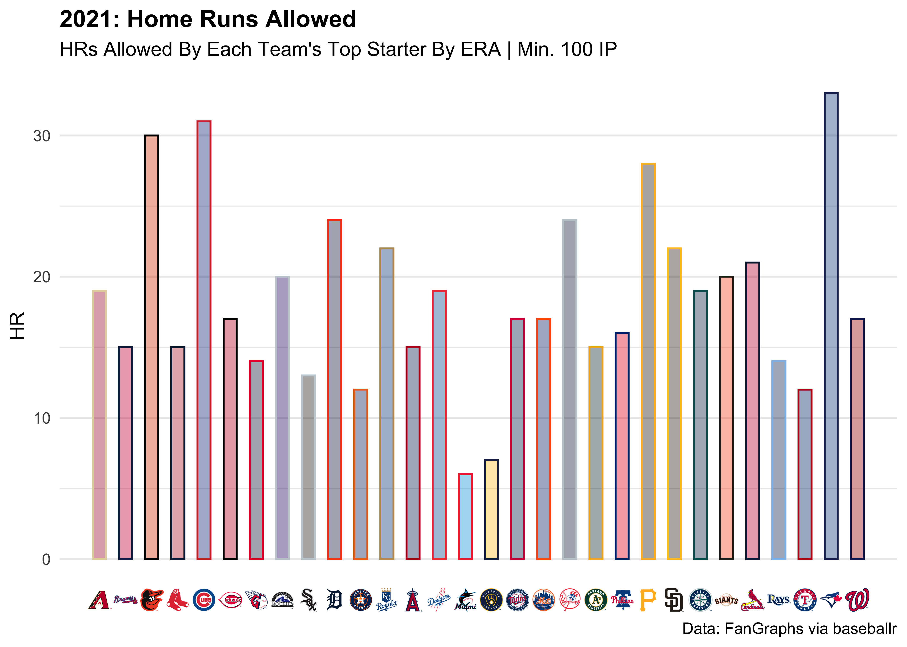

<!-- README.md is generated from README.Rmd. Please edit that file -->

# mlbplotR <a></a>

<!-- badges: start -->

[](https://lifecycle.r-lib.org/articles/stages.html)
<!-- badges: end -->

The code for this package was copied heavily from
[nflplotR](https://nflverse.github.io/nflplotR/index.html) with minor
changes to support Major League Baseball logos.

The goal of mlbplotR is to provide functions and geoms that help with
visualizations of MLB related analysis. It provides ggplot2 geoms that
do the heavy lifting of plotting MLB logos in high quality, with correct
aspect ratio, and possible transparency.

## Installation

mlbplotR is currently not on [CRAN](https://CRAN.R-project.org) but you
can get the development version from [GitHub](https://github.com/) with:

``` r
# install.packages("devtools")
devtools::install_github("camdenk/mlbplotR")
```

## Examples

Let’s plot every team on a grid with some extra customization:

``` r
library(mlbplotR)
library(ggplot2)
library(dplyr)

teams_colors_logos <- mlbplotR::load_mlb_teams() |> 
  dplyr::filter(!team_abbr %in% c("AL", "NL", "MLB")) |> 
  dplyr::mutate(
    a = rep(1:6, 5),
    b = sort(rep(1:5, 6), decreasing = TRUE),
    alpha = ifelse(grepl("A", team_abbr), 1, 0.75), # Keep alpha == 1 for teams that have an "A"
    color = ifelse(grepl("E", team_abbr), "b/w", NA) # Set teams that have an "E" to black & white
  )


 ggplot2::ggplot(teams_colors_logos, aes(x = a, y = b)) +
   mlbplotR::geom_mlb_logos(aes(team_abbr = team_abbr, color = color, alpha = alpha), width = 0.075) +
   ggplot2::geom_label(aes(label = team_abbr), nudge_y = -0.35, alpha = 0.5) +
   ggplot2::scale_color_identity() +
   ggplot2::scale_alpha_identity() +
   ggplot2::theme_void() 
```


This is a basic example with [FanGraphs](https://fangraphs.com) data
(pulled using baseballr) which compares ERA to FIP for each team’s top
starting pitcher by ERA:

``` r
library(baseballr)
library(scales)

df <- baseballr::fg_pitcher_leaders(x = 2021, y = 2021, q = 100, pitcher_type = "sta")

filtered_df <- df |>
  dplyr::filter(Team != "- - -") |> 
  # FanGraphs Team abbreviations aren't the standard
  # for what's used in the plotting functions so 
  # you could clean them with the following line, 
  # but the geom_*_logos() functions should all
  # clean the abbreviations before plotting
  # 
  # dplyr::mutate(Team = clean_team_abbrs(Team)) |> 
  dplyr::group_by(Team) |> 
  dplyr::slice_min(ERA, n = 1) |> 
  dplyr::ungroup()

filtered_df |> 
  ggplot2::ggplot(aes(x = ERA, y = FIP)) +
  mlbplotR::geom_mlb_logos(aes(team_abbr = Team), width = 0.075, alpha = 0.7) +
  ggplot2::labs(title = "2021: ERA vs. FIP",
                subtitle = "Each Team's Top Starter By ERA | Min. 100 IP",
                caption = "Data: FanGraphs via baseballr") +
  ggplot2::theme_minimal() +
  ggplot2::theme(plot.title = ggplot2::element_text(face = "bold")) +
  ggplot2::scale_x_reverse(breaks = scales::pretty_breaks(), expand = c(.1, .1)) +
  ggplot2::scale_y_reverse(breaks = scales::pretty_breaks(), expand = c(.1, .1))
```


Here’s another that looks at Home Runs Allowed by top pitchers:

``` r
filtered_df |> 
  ggplot2::ggplot(aes(x = Team, y = HR)) +
  ggplot2::geom_col(aes(color = Team, fill = Team), width = 0.5) +
  mlbplotR::geom_mlb_logos(aes(team_abbr = Team), width = 0.07, alpha = 0.9) +
  mlbplotR::scale_color_mlb(type = "secondary") +
  mlbplotR::scale_fill_mlb(alpha = 0.4) +
  ggplot2::labs(title = "2021: Home Runs Allowed For Top Pitchers",
                subtitle = "HRs Allowed By Each Team's Top Starter By ERA | Min. 100 IP",
                caption = "Data: FanGraphs via baseballr") +
  ggplot2::theme_minimal() +
  ggplot2::theme(plot.title = ggplot2::element_text(face = "bold"),
                 axis.title.x = ggplot2::element_blank(),
                 axis.text.x = ggplot2::element_blank(),
                 panel.grid.major.x = element_blank()) +
  ggplot2::scale_x_discrete(expand = c(0.05, 0.075))
```


Instead of putting the logos in the plot, we can have them be the axis
labels:

``` r
filtered_df |> 
  # The scale_*_mlb() functions don't auto-clean abbreviations
  dplyr::mutate(Team = clean_team_abbrs(Team)) |> 
  ggplot2::ggplot(aes(x = Team, y = HR)) +
  ggplot2::geom_col(aes(color = Team, fill = Team), width = 0.5) +
  #mlbplotR::geom_mlb_logos(aes(team_abbr = Team), width = 0.07, alpha = 0.9) +
  mlbplotR::scale_color_mlb(type = "secondary") +
  mlbplotR::scale_fill_mlb(alpha = 0.4) +
  ggplot2::labs(title = "2021: Home Runs Allowed",
                subtitle = "HRs Allowed By Each Team's Top Starter By ERA | Min. 100 IP",
                caption = "Data: FanGraphs via baseballr") +
  ggplot2::theme_minimal() +
  ggplot2::theme(plot.title = ggplot2::element_text(face = "bold"),
                 axis.title.x = ggplot2::element_blank(),
                 panel.grid.major.x = ggplot2::element_blank(),
                 # this line triggers the replacement of team abbreviations with logos
                 axis.text.x = mlbplotR::element_mlb_logo()) +
  ggplot2::scale_x_discrete(expand = c(0.05, 0.075))
```



The family of `element_*()` functions allows for a lot of extra
customization with axes labels and can even be used for
`facet_wrap()/facet_grid()` strip headers.

Lastly, here’s an example using headshots:

``` r
df |> 
  dplyr::mutate(playerid = as.double(playerid)) |> 
  dplyr::left_join(mlbplotR::load_headshots(), by = c("playerid" = "fangraphs_id")) |> 
  dplyr::slice_min(ERA, n = 12) |> 
  ggplot(aes(x = ERA, y = FIP)) +
  mlbplotR::geom_mlb_headshots(aes(player_id = savant_id), height = 0.15) +
  ggplot2::scale_x_reverse(breaks = scales::pretty_breaks(), expand = c(.1, .1)) +
  ggplot2::scale_y_reverse(breaks = scales::pretty_breaks(), expand = c(.1, .1)) +
  ggplot2::labs(title = "2021 SP ERA Leaders",
                subtitle = "Starters Who Only Played For One Team | Min 100 IP",
                caption = "Data: FanGraphs via baseballr") +
  ggplot2::theme_minimal() +
  ggplot2::theme(plot.title = ggplot2::element_text(face = "bold"))
```


Note: If a player’s headshot data can’t be found, their headshot will be
replaced with the MLB logo.

## Contributing

Many hands make light work! Here are some ways you can contribute to
this project:

-   You can [open an
    issue](https://github.com/camdenk/mlbplotR/issues/new/choose) if
    you’d like to request specific data or report a bug/error.

## To Do

-   Create a package vignette
-   Add in mean/median line geoms
-   Continue to add player ids for headshots for those who haven’t
    played in the Statcast era
