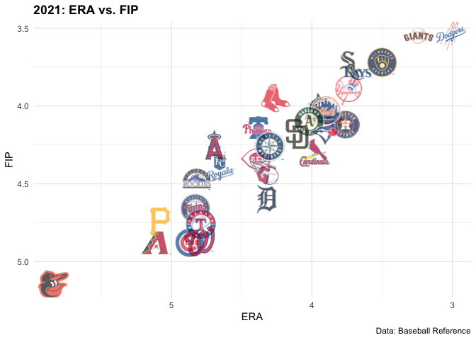

<!-- README.md is generated from README.Rmd. Please edit that file -->

# mlbplotR <a></a>

<!-- badges: start -->

[](https://lifecycle.r-lib.org/articles/stages.html)
<!-- badges: end -->

The code for this package was copied heavily from
[nflplotR](https://nflverse.github.io/nflplotR/index.html) with minor
changes to support Major League Baseball logos.

The goal of mlbplotR is to provide functions and geoms that help with
visualizations of MLB related analysis. It provides ggplot2 geoms that
do the heavy lifting of plotting MLB logos in high quality, with correct
aspect ratio, and possible transparency.

## Installation

mlbplotR is currently not on [CRAN](https://CRAN.R-project.org) but you
can get the development version from [GitHub](https://github.com/) with:

``` r
# install.packages("devtools")
devtools::install_github("camdenk/mlbplotR")
```

## Example

This is a basic example with [Baseball
Reference](https://baseball-reference.com) data which compares ERA to
FIP:

``` r
library(mlbplotR)
library(ggplot2)
library(dplyr)
#> 
#> Attaching package: 'dplyr'
#> The following objects are masked from 'package:stats':
#> 
#>     filter, lag
#> The following objects are masked from 'package:base':
#> 
#>     intersect, setdiff, setequal, union
library(readr)

teams_colors_logos <- mlbplotR::load_mlb_teams()

df <- readr::read_csv("./data-raw/2021 Team Pitching Stats.csv")
#> 
#> ── Column specification ────────────────────────────────────────────────────────
#> cols(
#>   .default = col_double(),
#>   Tm = col_character()
#> )
#> ℹ Use `spec()` for the full column specifications.
  
# Join leaderboard with abbrevations
joined_df <- df %>% 
  left_join(teams_colors_logos, by = c("Tm" = "team_name"))


joined_df %>% 
  ggplot2::ggplot(aes(x = ERA, y = FIP)) +
  mlbplotR::geom_mlb_logos(aes(team_savant_abbr = team_savant_abbr), width = 0.075, alpha = 0.7) +
  ggplot2::labs(
    caption = "Data: Baseball Reference",
    title = "2021: ERA vs. FIP"
  ) +
  ggplot2::theme_minimal() +
  ggplot2::theme(
    plot.title = ggplot2::element_text(face = "bold")
  ) +
  ggplot2::scale_x_reverse() +
  ggplot2::scale_y_reverse()
```



## Contributing

Many hands make light work! Here are some ways you can contribute to
this project:

-   You can [open an
    issue](https://github.com/camdenk/mlbplotR/issues/new/choose) if
    you’d like to request specific data or report a bug/error.

## To Do

-   Add ability to set axis labels to be logos
-   Add in player headshots (will likely have to wait until after the
    lockout)
