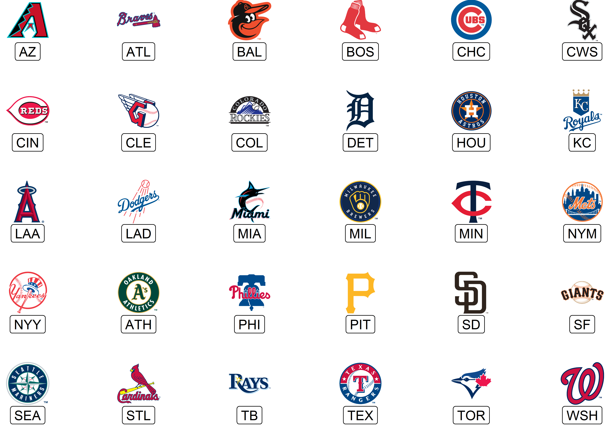

<!-- README.md is generated from README.Rmd. Please edit that file -->

# mlbplotR <a></a>

<!-- badges: start -->

[](https://lifecycle.r-lib.org/articles/stages.html)
[](https://github.com/camdenk/mlbplotR/actions/workflows/R-CMD-check.yaml)
<!-- badges: end -->

The code for this package was copied heavily from
[nflplotR](https://nflplotr.nflverse.com/index.html) with minor changes
to support Major League Baseball logos.

The goal of mlbplotR is to provide functions and geoms that help with
visualizations of MLB related analysis. It provides ggplot2 geoms that
do the heavy lifting of plotting MLB logos in high quality, with correct
aspect ratio, and possible transparency.

## Installation

The easiest way to get mlbplotR is to install it from
[CRAN](https://CRAN.R-project.org) with:

``` r
install.packages("mlbplotR")
```

To get a bug fix or use a feature from the development version, you can
install the development version from [GitHub](https://github.com/) with:

``` r
# install.packages("devtools")
devtools::install_github("camdenk/mlbplotR")
```

## Usage

Let’s plot every team on a grid with some extra customization:

``` r
library(mlbplotR)
library(ggplot2)
library(dplyr)

teams_colors_logos <- mlbplotR::load_mlb_teams() |> 
  dplyr::filter(!team_abbr %in% c("AL", "NL", "MLB")) |> 
  dplyr::mutate(
    a = rep(1:6, 5),
    b = sort(rep(1:5, 6), decreasing = TRUE),
    alpha = ifelse(grepl("A", team_abbr), 1, 0.75), # Keep alpha == 1 for teams that have an "A"
    color = ifelse(grepl("E", team_abbr), "b/w", NA) # Set teams that have an "E" to black & white
  )


 ggplot2::ggplot(teams_colors_logos, aes(x = a, y = b)) +
   mlbplotR::geom_mlb_logos(aes(team_abbr = team_abbr, color = color, alpha = alpha), width = 0.075) +
   ggplot2::geom_label(aes(label = team_abbr), nudge_y = -0.35, alpha = 0.5) +
   ggplot2::scale_color_identity() +
   ggplot2::scale_alpha_identity() +
   ggplot2::theme_void() 
```



There is a [getting started
guide](https://camdenk.github.io/mlbplotR/articles/mlbplotR.html) that
will walk you through more use cases for the package.

## Contributing

- [Open an issue](https://github.com/camdenk/mlbplotR/issues/new/choose)
  if you’d like to request specific data or report a bug/error.
